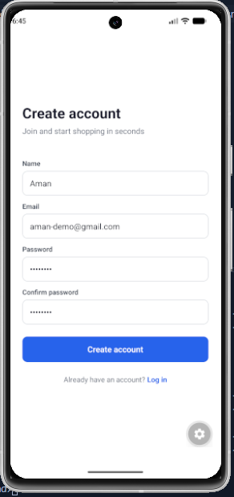
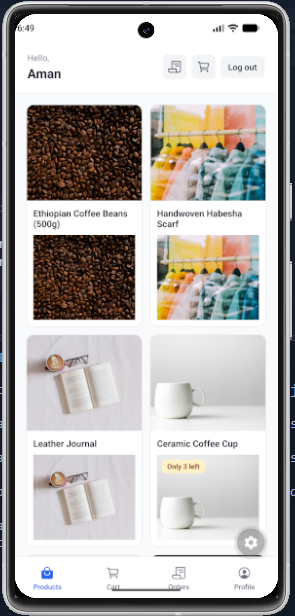
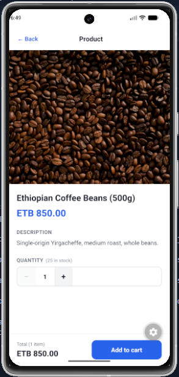
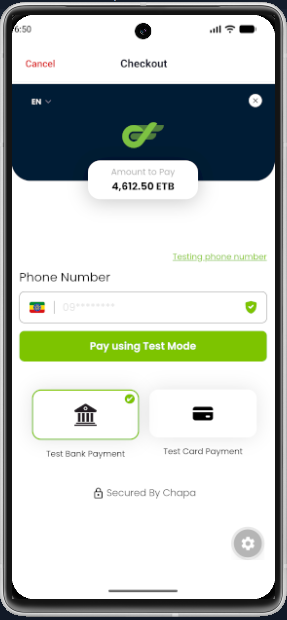
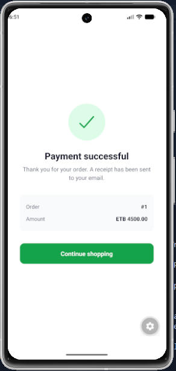
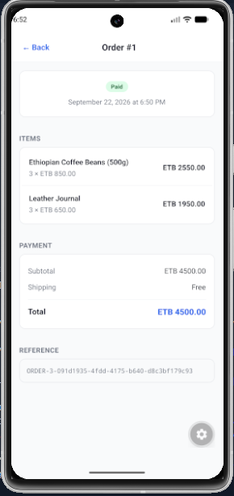

# Shopping Mobile App

A full-stack mobile shopping application built with **React Native + Expo** on the frontend and **Laravel REST API** on the backend.

The application supports authentication, product browsing, shopping cart management, checkout, Chapa payments, order history, and order details.

---

## Tech Stack


---

# Overview

This project is a mobile e-commerce application with a React Native frontend and Laravel backend.

The mobile application communicates with the Laravel API using HTTP requests through Axios.

The backend is responsible for authentication, products, cart operations, checkout, inventory management, order creation, and payment verification.

```text
┌──────────────────────────────┐
│      React Native App        │
│                              │
│  Expo + Expo Router          │
│  TypeScript                  │
│  Axios                       │
│  SecureStore                 │
│  Context API                 │
└──────────────┬───────────────┘
               │
               │ REST API
               ▼
┌──────────────────────────────┐
│        Laravel API           │
│                              │
│  Laravel Sanctum             │
│  Controllers                 │
│  Services                    │
│  Eloquent ORM                │
│  Database Transactions       │
│  Idempotency                 │
└──────────────┬───────────────┘
               │
               ▼
┌──────────────────────────────┐
│           MySQL              │
│                              │
│ Users                        │
│ Products                     │
│ Cart Items                   │
│ Orders                       │
│ Order Items                  │
│ Idempotency Keys             │
└──────────────────────────────┘
               │
               │ Payment API
               ▼
┌──────────────────────────────┐
│            Chapa             │
│                              │
│ Payment Initialization       │
│ Payment Verification         │
└──────────────────────────────┘

```
# Screenshots

## Authentication

| Register |
|:---:|
|  |

## Products

| Home | Product Detail |
|:---:|:---:|
|  |  |

## Cart & Payment

| Cart | Payment |
|:---:|:---:|
|  |  |

| Chapa | Payment Return |
|:---:|:---:|
|  |  |

## Orders

| Orders |
|:---:|
|  |

# How to Clone and Run

## 1. Clone the Repository

```bash
git clone https://github.com/elamany/chapa-ecommerce-mobile.git
cd chapa-ecommerce-mobile
```
## 2. Run the Laravel Backend

Open a terminal and navigate to the backend:

```bash
cd laravel-backend
```
Install PHP dependencies:

```bash
composer install
```
Create the environment file:

```bash
cp .env.example .env
```
Generate the Laravel application key:
```bash
php artisan key:generate
```
Configure your database and Chapa credentials in .env.
Example Laravel `.env` configuration:

```env
DB_CONNECTION=mysql
DB_HOST=127.0.0.1
DB_PORT=3306
DB_DATABASE=chapa_demo
DB_USERNAME=root
DB_PASSWORD=

CHAPA_SECRET_KEY=your_chapa_secret_key
CHAPA_RETURN_URL=https://your-cloudflare-tunnel-url.trycloudflare.com
```
> Replace `your_chapa_secret_key` with your Chapa test secret key and update `CHAPA_RETURN_URL` with your active Cloudflare Tunnel URL.

### Get a Chapa Test Secret Key

1. Create or log in to your Chapa account.
2. Open the Chapa dashboard.
3. Switch to the test/sandbox environment.
4. Go to the API keys or developer settings.
5. Copy your test secret key.
6. Add it to your Laravel `.env` file:

```env
CHAPA_SECRET_KEY=your_chapa_secret_key
```
You can use Cloudflare Tunnel to expose your local Laravel server to the internet for testing.

Install `cloudflared` from the official Cloudflare documentation:

https://developers.cloudflare.com/cloudflare-one/connections/connect-networks/downloads/

After installing `cloudflared`, start the Laravel server:

```bash
php artisan serve --host=0.0.0.0 --port=8000
```
Open another terminal and run:

```bash
cloudflared tunnel --url http://localhost:8000
```
Cloudflare will provide a temporary public URL similar to:

```text
https://example-name.trycloudflare.com
```
Use that URL as your Chapa return URL:

```env
CHAPA_RETURN_URL=https://example-name.trycloudflare.com
```
After changing `.env`, clear the Laravel configuration cache:

```bash
php artisan config:clear
```
## 3. Run the React Native Frontend

Open another terminal and navigate to the frontend:

```bash
cd reactnative-frontend
```
Install the required dependencies:

```bash
npm install
```
Start the Expo development server:

```bash
npx expo start
```

# Features

## Authentication

Users can:

- Register
- Login
- Logout
- Restore their authenticated session
- Access authenticated resources
- Access their own orders and cart

Authentication is handled by **Laravel Sanctum**.

The mobile application stores the authentication token using **Expo SecureStore**.

---

## Product Catalog

The application provides:

- Product listing
- Product pagination
- Product loading states
- Empty states
- Error states
- Retry functionality
- Pull-to-refresh
- Two-column product layout

Products are loaded from the Laravel REST API.

---

## Shopping Cart

Authenticated users can:

- View their cart
- Add products
- Update quantities
- Remove individual items
- Clear the entire cart
- View cart item count
- View cart total

The backend remains the source of truth for cart data.

---

## Checkout

The checkout process is handled by the Laravel backend.

The backend:

1. Reads the authenticated user's cart
2. Locks the relevant cart records
3. Checks product stock
4. Reserves stock atomically
5. Calculates the order total
6. Creates the order
7. Creates order items
8. Clears the cart
9. Initializes the Chapa payment
10. Returns the payment checkout URL

The frontend does not determine the final order price.

The backend calculates the final amount using the product prices stored on the server.

---

## Chapa Payments

The application integrates with **Chapa** for payment processing.

The backend handles:

- Payment initialization
- Transaction references
- Payment return handling
- Payment verification
- Amount verification
- Currency verification
- Order status updates

The mobile application opens the returned checkout URL for payment.

The payment return page exposes the payment state to the mobile application through HTML metadata.

---

## Idempotent Checkout

Checkout requests use an `Idempotency-Key`.

This protects the system from duplicate orders when the client retries a checkout request because of:

- Network failures
- Timeouts
- Duplicate taps
- Mobile connection interruptions
- HTTP retries

The same idempotency key can safely be reused for the same checkout attempt.

The database should enforce uniqueness on:

```text
user_id + key
```
Example migration constraint:

```php
$table->unique(['user_id', 'key']);
```
## Stock Concurrency Protection

Inventory updates are protected against concurrent checkout requests.

The checkout process uses database row locking and atomic stock updates.

Example:

```php
$affected = Product::where('id', $item->product_id)
    ->where('stock', '>=', $item->quantity)
    ->decrement('stock', $item->quantity);
```
If the update affects zero rows, the requested quantity is not available.

This prevents the application from reducing stock below zero when multiple users attempt to purchase the same product simultaneously.

---

## Database Transactions

The critical checkout operations are executed inside a database transaction.

The transaction covers:

- Cart reading
- Stock reservation
- Order creation
- Order item creation
- Cart deletion

The external Chapa API call happens after the database transaction is committed.

If Chapa initialization fails, the backend performs a compensation step by restoring the reserved stock and marking the order as failed.

This avoids keeping a database transaction open while waiting for an external payment service.

---
# API Endpoints

## Public Endpoints

| Method | Endpoint | Description |
|---|---|---|
| POST | `/api/login` | Login |
| POST | `/api/register` | Register |
| GET | `/api/products` | Get products |
| GET | `/api/products/{id}` | Get a product |
| GET | `/api/payment/return` | Chapa payment return |

## Authenticated Endpoints

All endpoints below require a valid Sanctum token.

| Method | Endpoint | Description |
|---|---|---|
| GET | `/api/user` | Get authenticated user |
| POST | `/api/logout` | Logout |
| GET | `/api/cart` | Get cart |
| POST | `/api/cart` | Add item to cart |
| PATCH | `/api/cart/{id}` | Update cart item |
| DELETE | `/api/cart/{id}` | Remove cart item |
| DELETE | `/api/cart` | Clear cart |
| POST | `/api/checkout` | Create checkout |
| GET | `/api/orders` | Get user's orders |
| GET | `/api/orders/{id}` | Get order details |

---

# Authentication Flow

```text
User
 │
 │ Login
 ▼
React Native
 │
 │ POST /api/login
 ▼
Laravel
 │
 │ Validate credentials
 ▼
Sanctum Token
 │
 │ user + token
 ▼
React Native
 │
 │ Store token
 ▼
Expo SecureStore
```
For authenticated requests:

```text
React Native
     │
     │ Authorization: Bearer <token>
     ▼
Laravel API
     │
     ▼
Laravel Sanctum
     │
     ▼
Authenticated User
```
# Checkout Flow

```text
User
 │
 │ Press Checkout
 ▼
React Native
 │
 │ Generate Idempotency-Key
 ▼
POST /api/checkout
 │
 ▼
Laravel
 │
 ├── Check Idempotency-Key
 │
 ├── Read Cart
 │
 ├── Lock Cart Items
 │
 ├── Check Stock
 │
 ├── Reserve Stock
 │
 ├── Calculate Total
 │
 ├── Create Order
 │
 ├── Create Order Items
 │
 └── Clear Cart
 │
 ▼
Transaction Commit
 │
 ▼
Initialize Chapa
 │
 ▼
Checkout URL
 │
 ▼
React Native
 │
 ▼
Chapa Payment
 │
 ▼
Payment Return
 │
 ▼
Chapa Verification
 │
 ▼
Order SUCCESS / FAILED / PENDING
```
---

# License

This project is licensed under the MIT License.

See the `LICENSE` file for more information.

---

# Contact

For questions, feedback, or collaboration:

- **GitHub:** [Your GitHub Profile](https://github.com/elamany)
- **Email:** ammanuael@gmail.com

Feel free to open an issue or submit a pull request if you would like to contribute to the project.